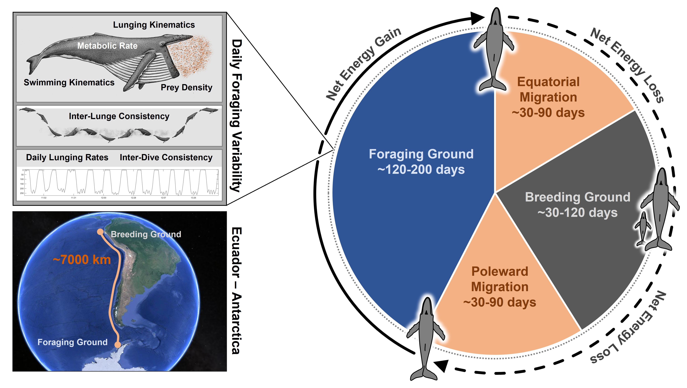
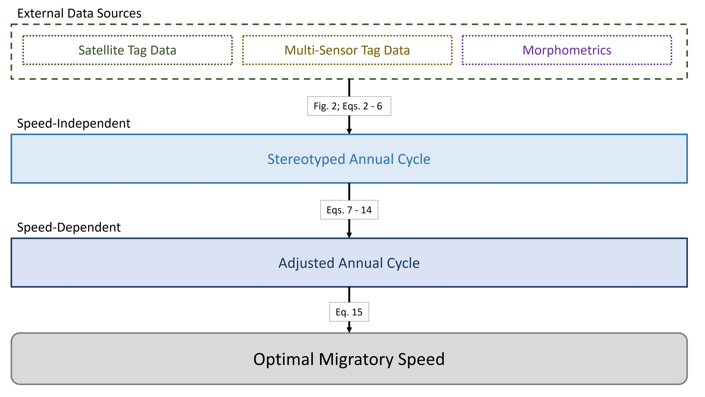

```{r setup, include=FALSE}
knitr::opts_chunk$set(echo = TRUE)
```

```{r Libraries, include=FALSE}
library(tidyverse)
library(ggplot2)
library(cowplot)
library(dplyr)
library(knitr)
library(tinytex)
library(rbbt)
library(ggspatial)
library(grid)
library(gridExtra)
```

```{r Literature Review Import, echo=FALSE}
load("data/MigrationDistancesLit.rda")

MigrationDistancesLit <- MigrationDistancesLit %>% 
  filter(Complete == "Y") 

LitDataForTable <- MigrationDistancesLit %>% 
  subset(select = c(Species, Source, Migratory_Route_Simple, Direction_of_Travel, Migration_Distance_km, Migration_Duration_days, Migration_Speed_m_s)) %>% 
  rename('Species' = 'Species',
         'Data Source' = 'Source',
         'Migratory Route' = 'Migratory_Route_Simple',
         'Direction' = 'Direction_of_Travel',
         'Distance' = 'Migration_Distance_km',
         'Duration' = 'Migration_Duration_days',
         'Speed' = 'Migration_Speed_m_s')

MigrationDistancesLitAvgs <- MigrationDistancesLit %>% 
  filter(Complete == "Y") %>% 
  group_by(Source, Species, Migratory_Route_Simple, Direction_of_Travel) %>% 
  summarize(Migration_Distance_km = mean(Migration_Distance_km),
            Migration_Duration_days = mean(Migration_Duration_days),
            Migration_Speed_m_s = mean(Migration_Speed_m_s),
            Number_of_Observations = n(),
            .groups = 'drop')
```

```{r Annual Cycle Variables, include=FALSE}
BreedingDays = 90
MigratoryDays = 60
FeedDays = 120 
```

```{r Load/Elongate Energetic Model, include=FALSE}
load("data/EnergyModel.rda")

EnergyModel <- EnergyModel %>% 
  slice(rep(1:n(), each = 61))
```

``` {r Feeding Day Net Energy Calculations, include=FALSE}         
EnergyModel <- EnergyModel %>% 
  mutate(Log10_EcostFeedDay_kJ = (1.0087*Log10BodyLength_m)+5.1886,
         EcostFeedDay_kJ = 10^Log10_EcostFeedDay_kJ,
         Log10_EgainFeedDay_kJ = (1.3027*Log10BodyLength_m)+5.8972,
         EgainFeedDay_kJ = 10^Log10_EgainFeedDay_kJ,
         EnetFeedDay_kJ = EgainFeedDay_kJ - EcostFeedDay_kJ,
         EnetFeedYear_kJ = EnetFeedDay_kJ*FeedDays)
```

```{r Insert Metabolic Calculations, include=FALSE}
EnergyModel <- EnergyModel %>% 
  mutate(RobMR = (1.6*4.1*(BodyMassFromShirel_kg^0.75))/1000,
         MaxKleiberBMR = OptimalWhaleMigration::pred_mr(mass_kg = BodyMassFromShirel_kg, 
                                                        mr_method = "kleiber", unit = "kJ_day"),
         MaxWhiteSeymourBMR = OptimalWhaleMigration::pred_mr(mass_kg = BodyMassFromShirel_kg, 
                                                             mr_method = "whiteseymour", unit = "kJ_day"),
         MaxKolokotronesetalBMR = OptimalWhaleMigration::pred_mr(mass_kg = BodyMassFromShirel_kg, 
                                                                 mr_method = "kolokotronesetal", unit = "kJ_day"))
```

```{r Efficiency Variables, include=FALSE}
MetEff = 0.25
PropEff = 0.90
```

```{r Swimming Variables, include=FALSE}
SpeedConversion = 2.0
PercFluking = rep(c(0.35,0.4,0.55,0.65), each = 305)
SpeedSeq = seq(1, 4, by=0.05)
SwimSpeeds = rep(SpeedSeq, length.out = length(SpeedSeq)*20)
OverGroundSpeedSeq = seq(0.5, 2.0, by=0.025)
OverGroundSpeeds = rep(OverGroundSpeedSeq, length.out = length(OverGroundSpeedSeq)*20)

```

```{r Thrust Power and Cost of Swimming Calculations, include=FALSE}
EnergyModel <- EnergyModel %>% 
  mutate(PercFluking = PercFluking,
         SwimSpeeds = SwimSpeeds,
         OverGroundSpeeds = OverGroundSpeeds,
         Log10_ThrustPower_W_Kg = 0.381*(SwimSpeeds)-1.215,
         ThrustPower_W_kg = 10^Log10_ThrustPower_W_Kg,
         
         ECostSwim_J_s = ((ThrustPower_W_kg*BodyMassFromShirel_kg)/(MetEff*PropEff))+(MaxKleiberBMR*1000/86400),
         ECostSwim_kJ_s = ECostSwim_J_s/1000,
         ECostSwim_kJ_Day = (ECostSwim_kJ_s*(86400*PercFluking))+(MaxKleiberBMR*(1-PercFluking)))

```

```{r Migration Duration, include=FALSE}
EnergyModel <- EnergyModel %>% 
  mutate(MigrationDuration2000Km_Days = 2000*1000/OverGroundSpeeds/86400,
         MigrationDuration4000Km_Days = 4000*1000/OverGroundSpeeds/86400,
         MigrationDuration6000Km_Days = 6000*1000/OverGroundSpeeds/86400,
         MigrationDuration8000Km_Days = 8000*1000/OverGroundSpeeds/86400,
         MigrationDuration10000Km_Days = 10000*1000/OverGroundSpeeds/86400,
         MigrationDuration12000Km_Days = 12000*1000/OverGroundSpeeds/86400)
```

```{r Energetic Cost of Migration, include=FALSE}
EnergyModel <- EnergyModel %>% 
  mutate(ECostMigration2000Km_kJ = ECostSwim_kJ_Day*MigrationDuration2000Km_Days,
         ECostMigration4000Km_kJ = ECostSwim_kJ_Day*MigrationDuration4000Km_Days,
         ECostMigration6000Km_kJ = ECostSwim_kJ_Day*MigrationDuration6000Km_Days,
         ECostMigration8000Km_kJ = ECostSwim_kJ_Day*MigrationDuration8000Km_Days,
         ECostMigration10000Km_kJ = ECostSwim_kJ_Day*MigrationDuration10000Km_Days,
         ECostMigration12000Km_kJ = ECostSwim_kJ_Day*MigrationDuration12000Km_Days,
         BiDirectionalECostMigration2000Km_kJ = ECostMigration2000Km_kJ*2,
         BiDirectionalECostMigration4000Km_kJ = ECostMigration4000Km_kJ*2,
         BiDirectionalECostMigration6000Km_kJ = ECostMigration6000Km_kJ*2,
         BiDirectionalECostMigration8000Km_kJ = ECostMigration8000Km_kJ*2,
         BiDirectionalECostMigration10000Km_kJ = ECostMigration10000Km_kJ*2,
         BiDirectionalECostMigration12000Km_kJ = ECostMigration12000Km_kJ*2)
```

``` {r Change in Feeding Days / Energy, include=FALSE}
EnergyModel <- EnergyModel %>% 
  mutate(ChangeInFeedDays2000Km_Days = MigratoryDays-MigrationDuration2000Km_Days,
         ChangeInFeedDays4000Km_Days = MigratoryDays-MigrationDuration4000Km_Days,
         ChangeInFeedDays6000Km_Days = MigratoryDays-MigrationDuration6000Km_Days,
         ChangeInFeedDays8000Km_Days = MigratoryDays-MigrationDuration8000Km_Days,
         ChangeInFeedDays10000Km_Days = MigratoryDays-MigrationDuration10000Km_Days,
         ChangeInFeedDays12000Km_Days = MigratoryDays-MigrationDuration12000Km_Days,
         ChangeInENetFeedYear2000Km_kJ = EnetFeedDay_kJ*ChangeInFeedDays2000Km_Days,
         ChangeInENetFeedYear4000Km_kJ = EnetFeedDay_kJ*ChangeInFeedDays4000Km_Days,
         ChangeInENetFeedYear6000Km_kJ = EnetFeedDay_kJ*ChangeInFeedDays6000Km_Days,
         ChangeInENetFeedYear8000Km_kJ = EnetFeedDay_kJ*ChangeInFeedDays8000Km_Days,
         ChangeInENetFeedYear10000Km_kJ = EnetFeedDay_kJ*ChangeInFeedDays10000Km_Days,
         ChangeInENetFeedYear12000Km_kJ = EnetFeedDay_kJ*ChangeInFeedDays12000Km_Days)
```

```{r Adjusted Feeding Days / Energy, include=FALSE}
EnergyModel <- EnergyModel %>% 
  mutate(FullYearAdjustedFeedDays2000Km_Days = FeedDays+((MigratoryDays-MigrationDuration2000Km_Days)*2),
         FullYearAdjustedFeedDays4000Km_Days = FeedDays+((MigratoryDays-MigrationDuration4000Km_Days)*2),
         FullYearAdjustedFeedDays6000Km_Days = FeedDays+((MigratoryDays-MigrationDuration6000Km_Days)*2),
         FullYearAdjustedFeedDays8000Km_Days = FeedDays+((MigratoryDays-MigrationDuration8000Km_Days)*2),
         FullYearAdjustedFeedDays10000Km_Days = FeedDays+((MigratoryDays-MigrationDuration10000Km_Days)*2),
         FullYearAdjustedFeedDays12000Km_Days = FeedDays+((MigratoryDays-MigrationDuration12000Km_Days)*2),
         FullYearAdjustedFeedDays2000Km_Days = 
           ifelse(FullYearAdjustedFeedDays2000Km_Days < 0, 0, FullYearAdjustedFeedDays2000Km_Days),
         FullYearAdjustedFeedDays4000Km_Days = 
           ifelse(FullYearAdjustedFeedDays4000Km_Days < 0, 0, FullYearAdjustedFeedDays4000Km_Days),
         FullYearAdjustedFeedDays6000Km_Days = 
           ifelse(FullYearAdjustedFeedDays6000Km_Days < 0, 0, FullYearAdjustedFeedDays6000Km_Days),
         FullYearAdjustedFeedDays8000Km_Days = 
           ifelse(FullYearAdjustedFeedDays8000Km_Days < 0, 0, FullYearAdjustedFeedDays8000Km_Days),
         FullYearAdjustedFeedDays10000Km_Days = 
           ifelse(FullYearAdjustedFeedDays10000Km_Days < 0, 0, FullYearAdjustedFeedDays10000Km_Days),
         FullYearAdjustedFeedDays12000Km_Days = 
           ifelse(FullYearAdjustedFeedDays12000Km_Days < 0, 0, FullYearAdjustedFeedDays12000Km_Days),
         FullYearAdjustedENetFeedYear2000Km_kJ = EnetFeedDay_kJ*FullYearAdjustedFeedDays2000Km_Days,
         FullYearAdjustedENetFeedYear4000Km_kJ = EnetFeedDay_kJ*FullYearAdjustedFeedDays4000Km_Days,
         FullYearAdjustedENetFeedYear6000Km_kJ = EnetFeedDay_kJ*FullYearAdjustedFeedDays6000Km_Days,
         FullYearAdjustedENetFeedYear8000Km_kJ = EnetFeedDay_kJ*FullYearAdjustedFeedDays8000Km_Days,
         FullYearAdjustedENetFeedYear10000Km_kJ = EnetFeedDay_kJ*FullYearAdjustedFeedDays10000Km_Days,
         FullYearAdjustedENetFeedYear12000Km_kJ = EnetFeedDay_kJ*FullYearAdjustedFeedDays12000Km_Days)
```

```{r Energetic Ratio - Migration Output / Feeding Season Input, include=FALSE}
EnergyModel <- EnergyModel %>% 
  mutate(ERatio2000Km = BiDirectionalECostMigration2000Km_kJ/FullYearAdjustedENetFeedYear2000Km_kJ,
         ERatio4000Km = BiDirectionalECostMigration4000Km_kJ/FullYearAdjustedENetFeedYear4000Km_kJ,
         ERatio6000Km = BiDirectionalECostMigration6000Km_kJ/FullYearAdjustedENetFeedYear6000Km_kJ,
         ERatio8000Km = BiDirectionalECostMigration8000Km_kJ/FullYearAdjustedENetFeedYear8000Km_kJ,
         ERatio10000Km = BiDirectionalECostMigration10000Km_kJ/FullYearAdjustedENetFeedYear10000Km_kJ,
         ERatio12000Km = BiDirectionalECostMigration12000Km_kJ/FullYearAdjustedENetFeedYear12000Km_kJ,
         EPercentageMigToFeed2000Km = ERatio2000Km*100,
         EPercentageMigToFeed4000Km = ERatio4000Km*100,
         EPercentageMigToFeed6000Km = ERatio6000Km*100,
         EPercentageMigToFeed8000Km = ERatio8000Km*100,
         EPercentageMigToFeed10000Km = ERatio10000Km*100,
         EPercentageMigToFeed12000Km = ERatio12000Km*100,
         PercentageOfYearMig2000Km = (MigrationDuration2000Km_Days/360)*100,
         PercentageOfYearMig4000Km = (MigrationDuration4000Km_Days/360)*100,
         PercentageOfYearMig6000Km = (MigrationDuration6000Km_Days/360)*100,
         PercentageOfYearMig8000Km = (MigrationDuration8000Km_Days/360)*100,
         PercentageOfYearMig10000Km = (MigrationDuration10000Km_Days/360)*100,
         PercentageOfYearMig12000Km = (MigrationDuration12000Km_Days/360)*100,
         PercentageRatioEOverTimeMig2000Km = EPercentageMigToFeed2000Km/PercentageOfYearMig2000Km,
         PercentageRatioEOverTimeMig4000Km = EPercentageMigToFeed4000Km/PercentageOfYearMig4000Km,
         PercentageRatioEOverTimeMig6000Km = EPercentageMigToFeed6000Km/PercentageOfYearMig6000Km,
         PercentageRatioEOverTimeMig8000Km = EPercentageMigToFeed8000Km/PercentageOfYearMig8000Km,
         PercentageRatioEOverTimeMig10000Km = EPercentageMigToFeed10000Km/PercentageOfYearMig10000Km,
         PercentageRatioEOverTimeMig12000Km = EPercentageMigToFeed12000Km/PercentageOfYearMig12000Km)
```

```{r Mimimum Energy Swimming Speed, include=FALSE}
EnergyModel <- EnergyModel %>% 
  mutate(MinSpeed2000Km = SwimSpeeds[which(ERatio2000Km == min(ERatio2000Km))[1]],
         OverGroundMinSpeed2000Km = OverGroundSpeeds[which(ERatio2000Km == min(ERatio2000Km))[1]],
         MinSpeed4000Km = SwimSpeeds[which(ERatio4000Km == min(ERatio4000Km))[1]],
         OverGroundMinSpeed4000Km = OverGroundSpeeds[which(ERatio4000Km == min(ERatio4000Km))[1]],
         MinSpeed6000Km = SwimSpeeds[which(ERatio6000Km == min(ERatio6000Km))[1]],
         OverGroundMinSpeed6000Km = OverGroundSpeeds[which(ERatio6000Km == min(ERatio6000Km))[1]],
         MinSpeed8000Km = SwimSpeeds[which(ERatio8000Km == min(ERatio8000Km))[1]],
         OverGroundMinSpeed8000Km = OverGroundSpeeds[which(ERatio8000Km == min(ERatio8000Km))[1]],
         MinSpeed10000Km = SwimSpeeds[which(ERatio10000Km == min(ERatio10000Km))[1]],
         OverGroundMinSpeed10000Km = OverGroundSpeeds[which(ERatio10000Km == min(ERatio10000Km))[1]],
         MinSpeed12000Km = SwimSpeeds[which(ERatio12000Km == min(ERatio12000Km))[1]],
         OverGroundMinSpeed12000Km = OverGroundSpeeds[which(ERatio12000Km == min(ERatio12000Km))[1]])
```

```{r Optimum Speed Dataframe Creation, include=FALSE}
OptSpeedSummary <- EnergyModel %>% 
  group_by(Species) %>% 
  summarize(OptSpeed2000Km = OverGroundSpeeds[which(ERatio2000Km == min(ERatio2000Km))[1]],
            OptSpeed4000Km = OverGroundSpeeds[which(ERatio4000Km == min(ERatio4000Km))[1]],
            OptSpeed6000Km = OverGroundSpeeds[which(ERatio6000Km == min(ERatio6000Km))[1]],
            OptSpeed8000Km = OverGroundSpeeds[which(ERatio8000Km == min(ERatio8000Km))[1]],
            OptSpeed10000Km = OverGroundSpeeds[which(ERatio10000Km == min(ERatio10000Km))[1]],
            OptSpeed12000Km = OverGroundSpeeds[which(ERatio12000Km == min(ERatio12000Km))[1]], .groups = 'drop')

OptSpeedSummary <- OptSpeedSummary %>% 
  pivot_longer(
    cols = starts_with("OptSpeed"),
    names_to = "Distance",
    values_to = "OptSpeed"
  )

OptSpeedSummary$Distance <- gsub("OptSpeed", "", OptSpeedSummary$Distance)
OptSpeedSummary$Distance <- gsub("Km", "", OptSpeedSummary$Distance)
OptSpeedSummary$Distance <- as.numeric(OptSpeedSummary$Distance)

OptSpeedSummary$Duration <- ((OptSpeedSummary$Distance*1000)/OptSpeedSummary$OptSpeed)/86400
OptSpeedSummary$BiDirectDuration <- OptSpeedSummary$Duration*2

OptSpeedSummary$ChangedFeedDays <- (MigratoryDays*2)-OptSpeedSummary$BiDirectDuration
```

``` {r Migratory Energy Percentage Summary Dataframe Creation, include=FALSE}
migratory_distances <- c(
  "EPercentageMigToFeed2000Km" = 2000,
  "EPercentageMigToFeed4000Km" = 4000,
  "EPercentageMigToFeed6000Km" = 6000,
  "EPercentageMigToFeed8000Km" = 8000,
  "EPercentageMigToFeed10000Km" = 10000,
  "EPercentageMigToFeed12000Km" = 12000
)

EPercentages <- EnergyModel %>% 
  transmute(Species = factor(Species, levels = c("Antarctic Minke", "Humpback", "Fin", "Blue")),
            BodyLength_m = BodyLength_m,
            OverGroundSpeeds = OverGroundSpeeds,
            EPercentageMigToFeed2000Km = EPercentageMigToFeed2000Km,
            EPercentageMigToFeed4000Km = EPercentageMigToFeed4000Km,
            EPercentageMigToFeed6000Km = EPercentageMigToFeed6000Km,
            EPercentageMigToFeed8000Km = EPercentageMigToFeed8000Km,
            EPercentageMigToFeed10000Km = EPercentageMigToFeed10000Km,
            EPercentageMigToFeed12000Km = EPercentageMigToFeed12000Km) %>% 
  pivot_longer(EPercentageMigToFeed2000Km:EPercentageMigToFeed12000Km, names_to = "MigDistance", values_to = "Percent") %>% mutate(MigratoryDistance = migratory_distances[MigDistance])

EPercentagesSummary <- EPercentages %>%
  filter(!is.infinite(Percent)) %>%
  group_by(Species, MigratoryDistance) %>%
  summarize(
    Mean_Percent = mean(Percent),
    SE_Percent = mean_se(Percent),
    Min_Percent = min(Percent),
    OverGroundSpeeds = OverGroundSpeeds[which.min(Percent)],
    .groups = "drop"
  )

migratory_distances <- c(
  "PercentageRatioEOverTimeMig2000Km" = 2000,
  "PercentageRatioEOverTimeMig4000Km" = 4000,
  "PercentageRatioEOverTimeMig6000Km" = 6000,
  "PercentageRatioEOverTimeMig8000Km" = 8000,
  "PercentageRatioEOverTimeMig10000Km" = 10000,
  "PercentageRatioEOverTimeMig12000Km" = 12000
)

PercentagesRatio <- EnergyModel %>% 
  transmute(Species = factor(Species, levels = c("Antarctic Minke", "Humpback", "Fin", "Blue")),
            BodyLength_m = BodyLength_m,
            OverGroundSpeeds = OverGroundSpeeds,
            PercentageRatioEOverTimeMig2000Km = PercentageRatioEOverTimeMig2000Km,
            PercentageRatioEOverTimeMig4000Km = PercentageRatioEOverTimeMig4000Km,
            PercentageRatioEOverTimeMig6000Km = PercentageRatioEOverTimeMig6000Km,
            PercentageRatioEOverTimeMig8000Km = PercentageRatioEOverTimeMig8000Km,
            PercentageRatioEOverTimeMig10000Km = PercentageRatioEOverTimeMig10000Km,
            PercentageRatioEOverTimeMig12000Km = PercentageRatioEOverTimeMig12000Km) %>% 
  pivot_longer(PercentageRatioEOverTimeMig2000Km:PercentageRatioEOverTimeMig12000Km, names_to = "MigDistance", values_to = "Ratio") %>% mutate(MigratoryDistance = migratory_distances[MigDistance])

PercentagesRatioSummary <- PercentagesRatio %>%
  filter(!is.infinite(Ratio)) %>%
  group_by(Species, MigratoryDistance) %>%
  summarize(
    Mean_Ratio = mean(Ratio),
    SE_Ratio = mean_se(Ratio),
    Min_Ratio = min(Ratio),
    OverGroundSpeeds = OverGroundSpeeds[which.min(Ratio)],
    .groups = "drop"
  )
```

``` {r Satellite Data Energetic Estimates, include=FALSE}
PortionEnergyModel <- EnergyModel[c(123,733),c(1,5,10,13,16)]

AverageLitHumpBlueEnergy <- MigrationDistancesLit %>%
  group_by(Species) %>%
  filter(Species %in% c("Humpback", "Blue")) %>% 
  summarize(
    Migration_Distance_km = mean(Migration_Distance_km),
    Migration_Duration_days = mean(Migration_Duration_days),
    OverGroundSpeed = mean(Migration_Speed_m_s)) %>%
  left_join(PortionEnergyModel, by = "Species") %>% 
  mutate(Log10_ThrustPower_W_Kg = 0.381*(OverGroundSpeed*SpeedConversion)-1.215,
         ThrustPower_W_kg = 10^Log10_ThrustPower_W_Kg,
         
         ECostSwim_J_s = ((ThrustPower_W_kg*BodyMassFromShirel_kg)/(MetEff*PropEff))+(MaxKleiberBMR*1000/86400),
         ECostSwim_kJ_s = ECostSwim_J_s/1000,
         ECostSwim_kJ_Day = (ECostSwim_kJ_s*(86400*PercFluking))+(MaxKleiberBMR*(1-PercFluking)),
         ECostMigration = ECostSwim_kJ_Day*Migration_Duration_days,
         BiDirectionalECostMigration = ECostMigration*2,
         
         AdjustedFeedingDays = FeedDays+(FeedDays-(Migration_Duration_days*2)),
         FullYearAdjustedENetFeedYear = EnetFeedDay_kJ*AdjustedFeedingDays
  )

 AverageLitHumpBlueEnergyShort <- AverageLitHumpBlueEnergy %>% 
 transmute(Species = factor(Species, levels = c("Humpback", "Blue")),
            FullYearAdjustedENetFeedYear = FullYearAdjustedENetFeedYear, 
            BiDirectionalECostMigration = -BiDirectionalECostMigration) %>%
  pivot_longer(FullYearAdjustedENetFeedYear:BiDirectionalECostMigration, names_to = "FeedOrMig", values_to = "Energy_kJ")
```

# Summary

Long-distance migrations are one of the most energetically challenging behaviors observed within the animal kingdom and are undertaken to find seasonally variable food sources or move between spatially distinct foraging and breeding grounds. Minimizing the cost of transport throughout these migrations can have a large impact on the annual energetic economy of an animal. This is especially true for species that rely on the energy from a defined feeding season to last them throughout the year, a strategy known as capital breeding. Mysticete whales (Mysticeti) are a unique example of a group of capital breeders that perform long-distance migrations across ocean basins, likely necessitating a low cost of transport throughout those journeys. Using estimates of foraging and swimming energetic intake and costs for mysticetes of varying body sizes, we estimated the energy gained during a foraging season as well as the energy lost during migration. We used these values to parameterize stereotypical annual cycles as well as speed-dependent annual cycles that modeled the energetic cost of swimming at various speeds along a migratory route. From this model, we found optimal migratory speeds between 1-2 ms^-1^ for a range of migratory distances. We also determined that longer migrations are more costly and occur at higher speeds than shorter migrations, a result that we were able to validate with satellite tag data from multiple mysticete species. In a rapidly changing ocean, our findings suggest even small differences in the distance or speed of a migration could have major impacts on individual fitness.

# Results

Animal migration serves to re-distribute nutrients, increase genetic dispersal across population boundaries, and maximize fitness across a dynamic landscape [@dingleWhatMigration2007]. Many species transit thousands of kilometers in search of seasonally variable food resources [@blockTrackingApexMarine2011; @lasorteImplicationsMidlatitudeClimate2016; @merkleLargeHerbivoresSurf2016] or to move between spatially distinct foraging and breeding grounds [@kenneyMigrationForagingStrategies2020]. The energetic and fitness implications of these long-distance migrations has historically been poorly understood, especially in the marine environment where species may be cryptic or widely distributed in remote locations (citations). The advent of biologging technologies is beginning to change that picture, giving us insights into the fine-scale behavior and large-scale movements of individuals and species. One group that has benefited extensively from these new technologies is cetaceans, notably large baleen whales (Mysticeti) that are known to migrate across ocean basins (citations). 

Unlike terrestrial ungulates that forage during migration, baleen whales are capital breeders, meaning they have a defined feeding season (spring and summer months) and exhibit relatively little feeding behavior outside the feeding season [@lockyerGrowthEnergyBudgets1981]. Thus, baleen whales need to live off their reserves for the rest of the year [@drentPrudentParentEnergetic1980; @jonssonCapitalIncomeBreeding1997; @stephensCapitalBreedingIncome2009]. Given the large energetic costs that are thought to be associated with competitive mating (for males) and reproduction (for females) (citations), these species likely benefit from minimizing the cost of swimming throughout migration (citations). On the other hand, these species rely on ephemeral prey patches of fish, krill, and copepods [@carrollFlexibleUseDynamic2021; @goldbogenWhyWhalesAre2019] that may only exist during certain times of the year (citations), setting up a potential scenario in which individuals must weight the higher costs of a faster migration against the potential energetic gains of a longer feeding season. Here we attempt to quantify this energetic tradeoff using a combination of high-resolution and satellite tag datasets.



## Annual Energetic Economy

Recent studies on several baleen whale species combining biologging tags with UAS morphometrics and hydrodynamic physical modeling have produced high-resolution estimates of energetic intake and costs for both foraging and swimming [@goldbogenWhyWhalesAre2019; @savocaBaleenWhalePrey2021]. Using these estimates, we quantified the speed-dependent energetic economy of a feeding season (Fig 2A) and round-trip migration (Fig 2B) for four baleen whale species: blue (_Balaenoptera musculus_), fin (_Balaenoptera physalus_), humpback (_Megaptera novaeangliae_), and Antarctic minke (_Balaenoptera bonaerensis_). On a mass-specific basis, the Antarctic minke whale showed the most positive energetic economy from the foraging season, counter to previous studies [@goldbogenWhyWhalesAre2019; @goughFastFuriousEnergetic2022] suggesting that larger animals have the most positive energetic economy. The Antarctic minke also displayed the highest mass-specific migratory costs, in line with previous studies showing that mass-specific cost of transport decreases with increasing body size (citations). Combining the cost of migration from the net energy gain from a feeding season resulted in an estimate of the remaining energy that could be available for mating and reproduction during the breeding season (Fig 2C). The low cost of migration relative to feeding season intake results in higher mass-specific residual energy available to the Antarctic minke whale relative to larger species. For all species, the net energetic intake from the feeding season and the energetic cost of migration were heavily impacted by the migratory distance and swimming speed (need statistical model outputs). Summary energetic values for each species are given in Table X (need to finish).

Using our energetic estimates for the feeding season and migration, we calculated the percentage of annual energy consumed during migration. Figure 3 displays the minimum percentages for each species across the range of migratory distances in our model (2000-12000km), with each species exhibiting an increase in relative migratory cost as a function of distance. Of the four species, the relationship for the humpback whale increased the fastest.

``` {r MigrationEnergeticPercentages, echo=FALSE, message=FALSE, warning=FALSE, results='hide', fig.keep='all', fig.align='center', fig.dim = c(8, 4), fig.cap = "Figure 3. Migratory distance versus the minimum estimated migratory energy usage as a percentage of feeding season intake."}
pal <- c("Antarctic Minke" = "#009E73",  "Humpback" = "#D55E00", "Fin" = "#9100B2", "Blue" = "#0072B2", "Gray" = "darkgrey", "Sei" = "#FFCC00")

pMEP <- ggplot(EPercentagesSummary) +
  geom_density(data=filter(MigrationDistancesLit,Species!="Gray"), aes(x = Migration_Distance_km, y = ..scaled..*25, group = Species, fill = Species, alpha = 0.5), adjust = 1.5) +
  geom_smooth(method=loess, aes(x=MigratoryDistance, y=Min_Percent, color=Species)) +
  geom_point(aes(x=MigratoryDistance, y=Min_Percent, color=Species)) +
  scale_color_manual(values = pal) +
  scale_fill_manual(values = pal) +
  labs(x = "Migratory Distance (km)",
       y = "Migratory Energy Use (%)") +
  theme_classic(base_size = 8) +
  theme(axis.text = element_text(size = 10),
        axis.text.x = element_blank(),
        axis.title.y = element_text(size = 10, margin = margin(t = 0, r = 18, b = 0, l = 0)),
        axis.title.x = element_blank(),
        legend.position = "none",
        panel.grid.minor = element_blank())

 pMER <- ggplot(PercentagesRatioSummary, aes(x=MigratoryDistance, y=log10(Min_Ratio))) +
  geom_smooth(method=loess, aes(color=Species)) +
  geom_point(aes(color=Species)) +
  geom_hline(yintercept = 0, linetype = "dashed", alpha = 0.8) +
  scale_color_manual(values = pal) +
  labs(x = "Migratory Distance (km)",
       y = "Migratory Energy Vs. Time Budget") +
  theme_classic(base_size = 8) +
  theme(axis.text = element_text(size = 10),
        axis.title.y = element_text(size = 10, margin = margin(t = 0, r = 6, b = 0, l = 0)),
        axis.title.x = element_text(size = 10),
        legend.position = "none",
        panel.grid.minor = element_blank())

cowplot::plot_grid(pMEP, pMER,
                   nrow = 2,
                   ncol = 1,
                   align = "hv",
                   axis = "bl",
                   labels = NULL)

```

## Optimal Migratory Speed

We found a u-shaped relationship between the over-ground swimming speed of an individual and the ratio of net feeding season energy intake to migratory energy loss (Figure 4). Each curve displayed a single speed at which the energetic ratio was minimized, representing an optimal migratory speed. These optimal migratory speeds fell between 1-2 m s^-1^ and closely align with optimal cruising speeds found for the same species [@goughScalingSwimmingPerformance2019].

```{r SpeedCurves, echo=FALSE, message=FALSE, warning=FALSE, results='hide', fig.keep='all', fig.align='center', fig.dim = c(8, 4), fig.cap = "Figure 4. Relationship between $U_{over-ground}$ and $E_{ratio}$. Dotted lines denote the converted values for average $U_{swim}$ for each species in our analysis taken from @goughScalingSwimmingPerformance2019"}
pal <- c("Antarctic Minke" = "#009E73",  "Humpback" = "#D55E00", "Fin" = "#9100B2", "Blue" = "#0072B2", "Gray" = "darkgrey", "Sei" = "#FFCC00")

pSCa <- ggplot(EnergyModel) +
  geom_vline(xintercept = 2.09/2, linetype = 2, size = 1, colour = "#D55E00") +
  geom_vline(xintercept = 2.20/2, linetype = 2, size = 1, colour = "#0072B2") +
  geom_vline(xintercept = 2.35/2, linetype = 2, size = 1, colour = "#009E73") +
  geom_vline(xintercept = 2.88/2, linetype = 2, size = 1, colour = "#9100B2") +
  geom_smooth(method = loess, aes(x = OverGroundSpeeds, 
                                  y = log10(BiDirectionalECostMigration2000Km_kJ/FullYearAdjustedENetFeedYear2000Km_kJ)), colour = "black") +
  geom_smooth(method = loess, aes(x = OverGroundSpeeds, 
                                  y = log10(BiDirectionalECostMigration4000Km_kJ/FullYearAdjustedENetFeedYear4000Km_kJ)), colour = "black") +
  geom_smooth(method = loess, aes(x = OverGroundSpeeds, 
                                  y = log10(BiDirectionalECostMigration6000Km_kJ/FullYearAdjustedENetFeedYear6000Km_kJ)), colour = "black") +
  geom_smooth(method = loess, aes(x = OverGroundSpeeds, 
                                  y = log10(BiDirectionalECostMigration8000Km_kJ/FullYearAdjustedENetFeedYear8000Km_kJ)), colour = "black") +
  geom_smooth(method = loess, aes(x = OverGroundSpeeds, 
                                  y = log10(BiDirectionalECostMigration10000Km_kJ/FullYearAdjustedENetFeedYear10000Km_kJ)), colour = "black") +
  geom_smooth(method = loess, aes(x = OverGroundSpeeds, 
                                  y = log10(BiDirectionalECostMigration12000Km_kJ/FullYearAdjustedENetFeedYear12000Km_kJ)), colour = "black") +
  geom_segment(aes(x = OverGroundMinSpeed2000Km[1],
                   xend = OverGroundMinSpeed2000Km[1],
                   y = log10(min(BiDirectionalECostMigration2000Km_kJ/FullYearAdjustedENetFeedYear2000Km_kJ))+0.05,
                   yend = log10(min(BiDirectionalECostMigration2000Km_kJ/FullYearAdjustedENetFeedYear2000Km_kJ))+0.25),
               size = 2) +
  geom_segment(aes(x = OverGroundMinSpeed4000Km[1],
                   xend = OverGroundMinSpeed4000Km[1],
                   y = log10(min(BiDirectionalECostMigration4000Km_kJ/FullYearAdjustedENetFeedYear4000Km_kJ))+0.05,
                   yend = log10(min(BiDirectionalECostMigration4000Km_kJ/FullYearAdjustedENetFeedYear4000Km_kJ))+0.25),
               size = 2) +
  geom_segment(aes(x = OverGroundMinSpeed6000Km[1],
                   xend = OverGroundMinSpeed6000Km[1],
                   y = log10(min(BiDirectionalECostMigration6000Km_kJ/FullYearAdjustedENetFeedYear6000Km_kJ))+0.05,
                   yend = log10(min(BiDirectionalECostMigration6000Km_kJ/FullYearAdjustedENetFeedYear6000Km_kJ))+0.25),
               size = 2) +
  geom_segment(aes(x = OverGroundMinSpeed8000Km[1],
                   xend = OverGroundMinSpeed8000Km[1],
                   y = log10(min(BiDirectionalECostMigration8000Km_kJ/FullYearAdjustedENetFeedYear8000Km_kJ))+0.05,
                   yend = log10(min(BiDirectionalECostMigration8000Km_kJ/FullYearAdjustedENetFeedYear8000Km_kJ))+0.25),
               size = 2) +
  geom_segment(aes(x = OverGroundMinSpeed10000Km[1],
                   xend = OverGroundMinSpeed10000Km[1],
                   y = log10(min(BiDirectionalECostMigration10000Km_kJ/FullYearAdjustedENetFeedYear10000Km_kJ))+0.05,
                   yend = log10(min(BiDirectionalECostMigration10000Km_kJ/FullYearAdjustedENetFeedYear10000Km_kJ))+0.25),
               size = 2) +
  geom_segment(aes(x = OverGroundMinSpeed12000Km[1],
                   xend = OverGroundMinSpeed12000Km[1],
                   y = log10(min(BiDirectionalECostMigration12000Km_kJ/FullYearAdjustedENetFeedYear12000Km_kJ))+0.05,
                   yend = log10(min(BiDirectionalECostMigration12000Km_kJ/FullYearAdjustedENetFeedYear12000Km_kJ))+0.25),
               size = 2) +
  labs(x = bquote(U[over-ground]),
       y = bquote(Log[10]* E[ratio])) +
  coord_cartesian(ylim = c(-2,0.5)) +
  theme_classic(base_size = 8) +
  theme(axis.text = element_text(size = 24),
        axis.title = element_text(size = 30),
        legend.position = "none",
        legend.title = element_text(size = 18),
        legend.text = element_text(size = 18),
        panel.grid.minor = element_blank())

ggsave("figs/SpeedCurves.pdf", height = 480, width = 960, units = "mm", dpi = 300)

pSCb <- pSCa +
  theme_classic(base_size = 4) +
  theme(axis.text = element_text(size = 16),
        axis.title = element_text(size = 20),
        legend.position = "none",
        legend.title = element_text(size = 18),
        legend.text = element_text(size = 18),
        panel.grid.minor = element_blank())
plot(pSCb)

```

Increasing the migratory distance resulted in a higher curve and an increase in the optimal migratory speed. We further examined this relationship between migratory distance and swimming speed by collecting data from satellite tracks of migrating baleen whales (n=X) and comparing the distance travelled by those tagged animals against the over-ground swimming speed shown across those migrations (Figure 5). 

```{r LitModelSpeedCombination, echo=FALSE, message=FALSE, warning=FALSE, results='hide', fig.keep='all', fig.align='center', fig.dim = c(8, 4), fig.cap = "Figure 5. Relationship $D_{mig}$ and $U_{over-ground}$ for satellite tracks obtained from literature sources. Points denote single uni-directional migratory routes as described in Table 1, with size corresponding to the number of tag deployments averaged together from that migratory route. The dotted gray line denotes the relationship for these points, while the solid black line denotes the relationship between $D_{mig}$ and $U_{over-ground}$ taken from our modeled optimal over-ground speeds shown in Figure 5."}
pal <- c("Antarctic Minke" = "#009E73",  "Humpback" = "#D55E00", "Fin" = "#9100B2", "Blue" = "#0072B2", "Gray" = "darkgrey", "Sei" = "#FFCC00")


pLMSCa <- ggplot(OptSpeedSummary, aes(Distance, OptSpeed)) +
  geom_smooth(method = lm, colour = "black", fullrange=TRUE) +
  geom_smooth(data = MigrationDistancesLitAvgs, aes(Migration_Distance_km, Migration_Speed_m_s), method = lm, colour = "darkgrey", linetype = "dashed", fullrange=TRUE) +
  geom_point(data = MigrationDistancesLit, aes(Migration_Distance_km, Migration_Speed_m_s, color = Species, shape = Direction_of_Travel), alpha = 0.3) +
  geom_point(data = MigrationDistancesLitAvgs, aes(Migration_Distance_km, Migration_Speed_m_s, fill = Species, size = Number_of_Observations, shape = Direction_of_Travel)) +
  coord_cartesian(
    xlim = c(1500,12500),
    expand = TRUE) +
  scale_fill_manual(values = pal) +
  scale_color_manual(values = pal) +
  scale_shape_manual(values = c(21,22)) +
  labs(x = bquote(D[mig]* " (m s"^-1*")"),
       y = bquote(U[over-ground]* " (m s"^-1*")")) +
  theme_classic(base_size = 8) +
  theme(axis.text = element_text(size = 24),
        axis.title = element_text(size = 30),
        legend.position = "none",
        legend.title = element_text(size = 18),
        legend.text = element_text(size = 18),
        panel.grid.minor = element_blank())

ggsave("figs/LitModelSpeedCombination.pdf", height = 480, width = 960, units = "mm", dpi = 300)

pLMSCb <- pLMSCa +
  scale_size(range = c(2,8)) +
  theme_classic(base_size = 4) +
  theme(axis.text = element_text(size = 16),
        axis.title = element_text(size = 20),
        legend.position = "none",
        legend.title = element_text(size = 18),
        legend.text = element_text(size = 18),
        panel.grid.minor = element_blank())
plot(pLMSCb)

```

# Discussion

## Cost of Migration

Long-distance migrations have historically been thought of as a costly behavior only undertaken through extreme need (citation). This assumption may hold true for small species that exhibit high mass-specific costs of transport, but it is unclear if large-bodied animals with low mass-specific costs of transport are similarly burdened by long migrations. Our study sought to answer that question using a group containing some of the the largest-bodied animals to ever exist - the baleen whales - that also happen to perform some of the longest-distance migrations on a capital breeding lifestyle. Our results suggest that, for these species, mass-specific cost of transport does indeed decrease with increasing body size and remain low (Table X) relative to smaller species such as the XXX () and the XXX (). As a result of this low-cost swimming and the high foraging efficiency of baleen whale engulfment feeding (citations), the overall cost of migration as a function of feeding season energy intake for animals swimming in the middle of our migration distance range (~6000km) is between ~8-15%. In contrast, birds and fish have been shown to use up to X% and Y% of their annual energy budget on migratory flight and swimming, respectively (citations).

Outside of comparisons to other groups and species, we cannot say with certainty that the cost of migration for baleen whales is impactful or not within the context of their life history. Villegas-Amtmann et al. -@villegas-amtmannEastWestEnergetic2017 found that for the grey whale (ge.sp.), a feeding season intake reduction of ~30% would represent a significant impact on species fitness. For the species in our study, we used idealized estimates for feeding season intake, with the actual intake values likely to be lower by some amount. And since we do not have clear estimates of the cost of reproduction (need to check this), we can not be sure to what extent a moderate feeding season intake reduction might limit reproductive capacity.

## Tradeoffs Between Migratory Speed and Distance (Only Outline So Far)

- swimming faster incurs higher energetic costs, but higher benefits from increased foraging opportunities. Swimming too slowly is highly detrimental and results in missed foraging opportunities.

- If you need to swim a farther distance, it will be more costly, but it is in your best interest to incur those higher costs to swim faster and complete the migration more quickly.

- optimal swimming speeds are similar in many cases to optimal cruising speeds found in Gough et al. 2019.

- whales are migrating faster (satellite data) than expected by our model, even at lower migration distances, meaning they're trying to get to their destination faster.

- Our model doesn't take into account the possibility that the feeding season might be constrained by prey availability/dynamics, lessening the overall number of feeding days available.

- Our model also doesn't take into account variance in the timing of the breeding season. Instead, we assume (necessarily) that the breeding season is a constant length of time, with all of the speed-dependent variation from the migration being reflected in the length of the feeding season.

## PREVIOUS MANUSCRIPT DISCUSSION SECTION (POSSIBLE TO CANNIBALIZE)

Previous research on mysticetes has found that swimming at approximately ~2m s-1 minimizes energetic expenditure (Gough et al., 2019; Gough et al., 2021). Given the long temporal and geographic expanses of uninterrupted swimming occurring during migration, we expected our study species would adhere to ~2 m s-1 throughout their migrations. This is the case in our model, with optimal swimming speeds ranging from 1.9-2.5 m s-1. These optimal speeds results from the tradeoff between phenological constraints and swimming costs. If swimming speed is below optimal, the whale cannot make it to the foraging ground at the desired time and loses the energy from missed foraging days. If swimming speed is above optimal, propulsion becomes costly and decreases the overall efficiency of the migration, even as a higher speed results in more days on the foraging or breeding grounds.

Our speed model includes multiple axes of variation – such as migration distance and duration – that must be bounded by real-world data. The primary source for these data are satellite tags deployed on a limited number of individual whales from distinct populations across multiple species (Table 4.4). These satellite tags give us usage ranges for mysticete migration distance (~5000-20000 km) and duration (~60-180 days). Our model predicts that for migrations of a given fixed duration (120 days shown in Figure 4.3A), a longer migration is less efficient overall and requires a higher swimming speed to maintain optimal efficiency. For migration duration, our model predicts that optimal speed decreases slightly with increasing migration duration, as the animal budgets more time to make the same journey. 

Although we cannot determine the amount of time budgeted for migration by different individuals or species, we can use satellite tag dataset to compare the theoretical speed of migrations against their respective distance. For those two variables, our model shows a similar relationship to the satellite tag dataset, with speed increasing alongside migration distance. The average “over ground” speed estimates from the satellite tag dataset are lower than our predictions, likely resulting from the inclusion of depth changes or rest days that have been shown in some tracks.

Our model estimates the energetic efficiency of large whale migration, but also exposes the limitations of our knowledge base as it pertains to these massive animals. We do not have extensive information about the prey field surrounding foraging whales, only rough estimates (Goldbogen et al., 2019b). As a result, we must assume that our data for heavily foraging whales represents an upper limitation to foraging energetics, with the reality estimated to be lower by an unknown percentage. Our estimates for daily foraging rates and lunge capacity/volume are similarly maximal estimates, with reality likely being lower (Savoca et al., 2021). Metabolic rates for large whales are also unknown, hence our use of known scaling equations (Kleiber, 1975) for basal metabolic rate and our use of thrust power output to estimate of the cost of swimming. We opted to use thrust power estimates from Gough et al. (2021) instead of previously calculated values because thrust power estimates were calculated directly from mysticetes and not scaled up regressions from odontocetes or non-cetaceans (Williams et al., 2017; Czapanskiy et al., 2021b).

Our study is the first to calculate the energetics of mysticete migration across a range of body sizes. We have found that for these massive animals, migration is relatively cheap at the best of times, but can be costly during poor foraging years. We have found that tradeoffs between swimming speed, migration distance, and annual budgeting between time spent on the foraging ground and breeding ground can impact the overall energetic efficiency of a migration. In a rapidly changing ocean where food resources may become unpredictable, even small differences in the distance or duration of a migration could have major impacts on the fitness of mysticetes around the world.

# Materials & Methods

Informed by morphological [@kahane-rapportAllometricScalingMorphology2018] and UAV datasets [@goughScalingOscillatoryKinematics2021; @goughFastFuriousEnergetic2022], we chose a five-meter range of body lengths ($TL_{\text{body}}$) for each species.

## Satellite Tag Data

In a review of satellite tag data for migratory animals, we found data for blue (n = 41) and humpback (n = 27), with smaller numbers for the gray (_Eschrichtius robustus_; n = 2) and fin (n = 1) whales.

Satellite tag data was compiled from multiple literature sources and tag types (Table 1). To be included in our dataset, a satellite track had to include: 1) a complete migration moving in either direction (i.e. from foraging ground to breeding ground or vice-versa), 2) not include any portions of swimming on the foraging or breeding grounds, 3) the overall distance covered by the animal during the migration ($D_{\text{mig}}$; km), and 4) the duration of the migratory period ($T_{\text{mig.uni}}$; days). Using this data, we were able to calculate the GPS-based over-ground speed of each animal ($U_{\text{over-ground}}$; $m s^{-1}$) using the equation:

$$
U_{\text{over-ground}} = \frac{D_{\text{mig}}*1000}{T_{\text{mig.uni}}*86400} \quad (1)
$$

Using average values for $D_{\text{mig}}$, $T_{\text{mig.uni}}$, and $U_{\text{over-ground}}$ (Fig 1), we calculated the distance ($D_{\text{mig.avg}}$), duration ($T_{\text{mig.uni.avg}}$), and over-ground speed ($U_{\text{over-ground.avg}}$) for a stereotypical migratory route. We used these values to parameterize a standardized annual cycle as well as our energetic models.

```{r MigrationLiteratureDensities PDF Version, include=FALSE}
pDens1 <- ggplot(MigrationDistancesLit, aes(x = Migration_Duration_days)) + 
  geom_density(fill = 'grey60') + 
  geom_vline(aes(xintercept=mean(Migration_Duration_days)),
             linetype="dashed", size=1) +
  geom_text(aes(x = mean(Migration_Duration_days)+4, y = 0.0005, label=round(mean(Migration_Duration_days), digits = 0)), 
            size=14) +
  labs(x = bquote(T[mig]* " (days)"),
       y = "Density") +
  theme_classic(base_size = 8) +
  theme(axis.text.x = element_text(size = 24),
        axis.text.y = element_blank(),
        axis.title = element_text(size = 30),
        axis.ticks = element_blank(),
        legend.position = "none",
        panel.grid.minor = element_blank())

pDens2 <- ggplot(MigrationDistancesLit, aes(x = Migration_Speed_m_s)) + 
  geom_density(fill = 'grey60') + 
  geom_vline(aes(xintercept=mean(Migration_Speed_m_s)),
             linetype="dashed", size=1) +
  geom_text(aes(x = mean(Migration_Speed_m_s)+0.08, y = 0.028, label=round(mean(Migration_Speed_m_s), digits = 2)), 
            size=14) +
  labs(x = bquote(U[over-ground]* " (m s"^-1*")"),
       y = "Density") +
  theme_classic(base_size = 8) +
  theme(axis.text = element_text(size = 24),
        axis.text.y = element_blank(),
        axis.title = element_text(size = 30),
        axis.title.y = element_blank(),
        axis.ticks.y = element_blank(),
        legend.position = "none",
        panel.grid.minor = element_blank())

pDens3 <- ggplot(MigrationDistancesLit, aes(x = Migration_Distance_km)) + 
  geom_density(fill = 'grey60') + 
  geom_vline(aes(xintercept=mean(Migration_Distance_km)),
             linetype="dashed", size=1) +
  geom_text(aes(x = mean(Migration_Distance_km)+1400, y = 0.000005, label=round(mean(Migration_Distance_km), digits = 4)), 
            size=14) +
    labs(x = bquote(D[mig]* " (km)"),
       y = "Density") +
  theme_classic(base_size = 8) +
  theme(axis.text = element_text(size = 24),
        axis.text.y = element_blank(),
        axis.title = element_text(size = 30),
        axis.title.y = element_blank(),
        axis.ticks.y = element_blank(),
        legend.position = "none",
        panel.grid.minor = element_blank())

cowplot::plot_grid(pDens1, pDens2, pDens3,
                   nrow = 1,
                   ncol = 3,
                   align = "hv",
                   axis = "bl",
                   labels = NULL)

ggsave("figs/MigrationLiteratureDensities.pdf", height = 480, width = 960, units = "mm", dpi = 300)
```

```{r MigrationLiteratureDensities Markdown Version, echo=FALSE, message=FALSE, warning=FALSE, results='hide', fig.keep='all', fig.align='center', fig.dim = c(8, 4), fig.cap = "Figure 2. Density graphs for the migratory distance, duration, and over-ground speed. Vertical lines denote the mean value for each graph."}
pDens1b <- ggplot(MigrationDistancesLit, aes(x = Migration_Duration_days)) + 
  geom_density(fill = 'grey60') + 
  geom_vline(aes(xintercept=mean(Migration_Duration_days)),
             linetype="dashed", size=1) +
  geom_text(aes(x = mean(Migration_Duration_days)+8, y = 0.0008, label=round(mean(Migration_Duration_days), digits = 0)), 
            size=4) +
  labs(x = bquote(T[mig]* " (days)"),
       y = "Density") +
  theme_classic(base_size = 8) +
  theme(axis.text.x = element_text(size = 8),
        axis.text.y = element_blank(),
        axis.title = element_text(size = 12),
        axis.ticks = element_blank(),
        legend.position = "none",
        panel.grid.minor = element_blank())

pDens2b <- ggplot(MigrationDistancesLit, aes(x = Migration_Speed_m_s)) + 
  geom_density(fill = 'grey60') + 
  geom_vline(aes(xintercept=mean(Migration_Speed_m_s)),
             linetype="dashed", size=1) +
  geom_text(aes(x = mean(Migration_Speed_m_s)+0.12, y = 0.046, label=round(mean(Migration_Speed_m_s), digits = 2)), 
            size=4) +
  labs(x = bquote(U[over-ground]* " (m s"^-1*")"),
       y = "Density") +
  theme_classic(base_size = 8) +
  theme(axis.text = element_text(size = 8),
        axis.text.y = element_blank(),
        axis.title = element_text(size = 12),
        axis.title.y = element_blank(),
        axis.ticks.y = element_blank(),
        legend.position = "none",
        panel.grid.minor = element_blank())

pDens3b <- ggplot(MigrationDistancesLit, aes(x = Migration_Distance_km)) + 
  geom_density(fill = 'grey60') + 
  geom_vline(aes(xintercept=mean(Migration_Distance_km)),
             linetype="dashed", size=1) +
  geom_text(aes(x = mean(Migration_Distance_km)+1800, y = 0.000008, label=round(mean(Migration_Distance_km), digits = 2)), 
            size=4) +
    labs(x = bquote(D[mig]* " (km)"),
       y = "Density") +
  theme_classic(base_size = 8) +
  theme(axis.text = element_text(size = 8),
        axis.text.y = element_blank(),
        axis.title = element_text(size = 12),
        axis.title.y = element_blank(),
        axis.ticks.y = element_blank(),
        legend.position = "none",
        panel.grid.minor = element_blank())

pDens <- cowplot::plot_grid(pDens1b, pDens2b, pDens3b,
                            nrow = 1,
                            ncol = 3,
                            align = "hv",
                            axis = "bl",
                            labels = NULL)
plot(pDens)
```

## Standardized Annual Cycle

Our energetic models were predicated on a standardized annual cycle, with costs and benefits calculated as deviations from that cycle. In order to determine the portion of the year devoted to migration, we used our calculated $T_{\text{mig.uni.avg}}$ from our literature search and estimated to 60 days for a uni-directional migration ($T_{\text{mig.uni.standard}}$), resulting in 120 days spent migrating during a standardized annual cycle ($T_{\text{mig.year.standard}}$). For the time spent on the breeding ground ($T_{\text{breed.standard}}$), we estimated 90 days based on sightings data, specifically from Maui-Nui for humpback whales (van Aswegen, pers. comm.). Finally, we estimated the feeding season as the remaining portion of the year, set to 120 days ($T_{\text{feed.standard}}$). Reproduction and weaning of calves requires a set period of time and the sighting data suggest that the breeding season could be a more set duration than the feeding season. As a result, our model presumes that changes to the migratory duration due to swimming speed will result in a longer or shorter foraging season duration while the breeding season duration remains unchanged ().

## Foraging Season Energetics

We determined the net energy obtained from a day of foraging ($Enet_{\text{feed.day}}$; kJ) using the equation:

$$
E_{\text{feed.day}} = E_{\text{feed.day.gain}} - E_{\text{feed.day.cost}} \quad (2)
$$

where $E_{\text{feed.day.gain}}$ and $E_{\text{feed.day.cost}}$ are calculated for each species at a given body length using body length regressions calculated by @goughFastFuriousEnergetic2022. These regressions subtracted the energetic cost of a lunge feeding event from the energetic intake of that same event, then multiplied the duration of the lunge feeding event by the average number of lunges performed in a day for that species taken from @savocaBaleenWhalePrey2021. For the remaining portion of the day, we calculated the energetic cost per second using metabolic equations outlined by @goughFastFuriousEnergetic2022 and body mass ($M_{\text{body}}$; kg) calculated from body length using methods outlined by @kahane-rapportAllometricScalingMorphology2018. To determine the net energy flux for a standard feeding season ($E_{feed.year.standard}$; kJ), we multiplied $E_{\text{feed.day}}$ by the $T_{\text{feed.standard}}$ using the equation:

$$
E_{\text{feed.year.standard}} = E_{\text{feed.day}}*T_{\text{feed.standard}} \quad (3)
$$

## Migratory Route Energetics

We estimated the combined energetic cost of swimming and metabolism ($E_{\text{swim.sec}}$; $kJs^{-1}$) for each species at a given body length using the equation:

$$
E_{\text{swim.sec}} = 
(\frac{P_{\text{T}}*M_{\text{body}}}{\eta_{\text{met}}*\eta_{\text{prop}}}+
\frac{BMR_{\text{kleiber}}*1000}{86400}) \div 1000 \quad (4)
$$

where $P_{\text{T}}$ is the thrust power output ($Wkg^{-1}$) estimated for a given swimming speed ($U_{swim}$; $ms^{-1}$) with a regression taken from @goughScalingOscillatoryKinematics2021, $\eta_{\text{met}}$ is a metabolic efficiency factor set at 0.25 [@fishTransitionsDragbasedLiftbased1996; @fishReviewDolphinHydrodynamics1999; @potvinRorqualLungeFeedingEnergetics2021], $\eta_{\text{prop}}$ is a propulsive efficiency factor set at 0.90 [@goughScalingOscillatoryKinematics2021], $BMR_{\text{kleiber}}$ is the basal metabolic rate using a Kleiber function ($70*{M_{\text{body}}}^{075}$) [@kleiberMetabolicTurnoverRate1975]. To determine the energetic cost of a single migratory day ($E_{\text{mig-day}}$; kJ), we multiplied the per-second value of $E_{\text{swim.sec}}$ by the percentage of time spent actively fluking for each species ($\%_{\text{fluke}}$) and the number of seconds in a day:

$$
E_{\text{mig.day}} = (E_{\text{swim.sec}}*\%_{\text{fluke}}*86400) + ({BMR_{\text{kleiber}}}*(1-\%_{\text{fluke}})) \quad (5)
$$

We estimated $\%_{\text{fluke}}$ for each species using previously published tag data from the four species included in our analyses [@goughFastFuriousEnergetic2022]. These estimations resulted in 35% for the blue whale, 40% for for fin whale, 55% for the humpback whale, and 65% for the minke whale. Finally, we could calculate the overall cost of a migration ($E_{\text{mig.year.standard}}$) using the equation:

$$
E_{\text{mig.year.standard}} = E_{\text{mig.day}}*T_{\text{mig.year.standard}} \quad (6)
$$

## Speed-Adjusted Energetics

We used previously published data from 2 migrating blue whales [@oestreichAnimalBorneMetricsEnable2020] to compare straight-line migratory speed to both $U_{\text{over-ground}}$ and $U_{\text{swim}}$. These measurements resulted in a multiplicative factor to convert values of $U_{\text{over-ground}}$ from our literature review into $U_{\text{swim}}$ values that could be used to more accurately calculate $E_{\text{swim-sec}}$ (Figure 3). This factor also allowed us to create a range of speeds for both $U_{\text{over-ground}}$ and $U_{\text{swim}}$ to calculate changes in annual energy flux.

```{r BlueWhaleSpeedsMapped, echo=FALSE, message=FALSE, warning=FALSE, results='hide', fig.keep='last', fig.align='center', fig.dim = c(8, 4), fig.cap = "Figure 3. Data from two multi-sensor blue whale tag deployments used to calculate a conversion factor between over-ground speed and swimming speed. The map on the left shows the gps tracks for each whale during the period of migratory swimming. The graphs on the right show the time-depth traces for each whale during the same period of migratory swimming."}

load("data/bf.rda")
load("data/world.rda")
load("data/dataset1hz_tag11.rda")
load("data/dataset1hz_tag14.rda")
load("data/diveDataset.rda")
load("data/locDatasetMigration.rda")

pMap <- ggplot(data = world) +
  geom_sf() +
  coord_sf(xlim = c(min(diveDataset$Long,na.rm = TRUE)-.5, max(diveDataset$Long,na.rm = TRUE)+.5),
           ylim = c(min(diveDataset$Lat,na.rm = TRUE)-.5, max(diveDataset$Lat,na.rm = TRUE)+.5), expand = FALSE) +
  # add 500m contour
  geom_contour(data = bf,
               aes(x=x, y=y, z=z),
               breaks=c(-500),
               size=c(0.4),
               colour="darkgrey", show.legend = FALSE) +
  #geom_text_contour(data = bf, aes(x=x, y=y,z = z),breaks=c(-100,-200,-300,-400),
  #geom_text_contour(data = bf, aes(x=x, y=y,z = z),breaks=c(-500),
  #                  show.legend = FALSE, size = 2.2, alpha = .6, nudge_y = -.002) +
  geom_path(data = locDatasetMigration, aes(Long,Lat, color = depid),size=1) +
  annotation_scale(location = "bl", width_hint = 0.5) +
  xlab("Longitude") +
  ylab("Latitude") +
  theme_classic(base_size = 8) +
  theme(axis.text = element_text(size = 8),
        axis.title = element_text(size = 12),
        legend.position = "none",
        panel.grid.minor = element_blank(),
        panel.grid.major = element_line(color = gray(.5), linetype = "dashed", size = 0.2),
        panel.background = element_rect(fill = "aliceblue"))

pDive11 <- ggplot(data = dataset1hz_tag11) +
  geom_path(aes(x=dttz, y=-p), color = '#DA7964') +
  theme_classic(base_size = 8) +
  theme(axis.text = element_text(size = 8),
        axis.title = element_blank(),
        legend.position = "none",
        panel.grid.minor = element_blank(),
        panel.grid.major = element_blank(),
        panel.background = element_rect(fill = "aliceblue"))

pDive14 <- ggplot(data = dataset1hz_tag14) +
  geom_path(aes(x=dttz, y=-p), color = '#78D8D5') +
  theme_classic(base_size = 8) +
  theme(axis.text = element_text(size = 8),
        axis.title = element_blank(),
        legend.position = "none",
        panel.grid.minor = element_blank(),
        panel.grid.major = element_blank(),
        panel.background = element_rect(fill = "aliceblue"))
pDive14

y.lab <- textGrob("Depth (m)", 
                   gp=gpar(fontface="bold", fontsize=15), rot=90)

pDive <- cowplot::plot_grid(pDive11, pDive14,
                            nrow = 2,
                            ncol = 1,
                            align = "hv",
                            axis = "bl",
                            labels = NULL)

pDiveLabel <- grid.arrange(arrangeGrob(pDive, left = y.lab))

pMapDive <- cowplot::plot_grid(pMap, pDiveLabel,
                            nrow = 1,
                            ncol = 2,
                            align = "hv",
                            axis = "bl",
                            labels = NULL)
plot(pMapDive)
```

For a given $U_{\text{over-ground}}$ value, we could calculate an adjusted value for the duration of a uni-directional migratory period ($T_{\text{mig.uni.adj}}$) using the equation:

$$
T_{\text{mig.uni.adj}}=\frac{D_{\text{mig}}*1000*86400}{U_{\text{over-ground}}} \quad (7)
$$

with the overall days spent migrating during an annual cycle ($T_{\text{mig.year.adj}}$) given given as:

$$
T_{\text{mig.year.adj}}= T_{\text{mig.uni.adj}}*2 \quad (8)
$$

We could then update the uni-directional cost of migration ($E_{\text{mig.uni.adj}}$) using the equation:

$$
E_{\text{mig.uni.adj}} = E_{\text{mig.day}}*T_{\text{mig.uni.adj}} \quad (9)
$$

with the annual cost of migration given as:

$$
E_{\text{mig.year.adj}} = E_{\text{mig.uni.adj}}*2 \quad (10)
$$

We then used our $T_{\text{mig.year.adj}}$ values across our range of $U_{\text{over-ground}}$ to calculate the change in feeding season duration from $T_{\text{mig.year.standard}}$ due to migratory speed ($\Delta T_{\text{feed}}$) using the equation:

$$
\Delta T_{\text{feed.year}} = T_{\text{mig.year.adj}}-T_{\text{mig.year.standard}} \quad (11)
$$

and the subsequent change in net energy intake per year ($\Delta E_{\text{feed.year}}$) using the following equations:

$$
\Delta E_{\text{feed.year}} = E_{\text{feed-day}}*\Delta T_{\text{feed.year}} \quad (12)
$$

Next, we recalculated the net energy from the foraging season ($E_{\text{feed.year.adj}}$) using the equation:

$$
E_{\text{feed.year.adj}} = E_{\text{feed.year.standard}} - \Delta E_{\text{feed.year}} \quad (13)
$$

We then calculated the ratio of between $E_{\text{mig.year.adj}}$ and $E_{\text{feed.year.adj}}$ ($E_{ratio}$) using the following equation:

$$
E_{\text{ratio}} = \frac{E_{\text{mig.year.adj}}}{E_{\text{feed.year.adj}}} \quad (14)
$$

Finally, we could calculate the speed values (both $U_{\text{swim}}$ and $U_{\text{over-ground}}$) at which $E_{\text{ratio}}$ is minimized ($U_{opt}$) using the following equation:

$$
U_{\text{opt}} = min(E_{\text{ratio}}) \quad (15)
$$

We repeated these analyses for a range of $D_{\text{mig}}$ values from 4000-12000km, informed by our literature review. A schematic of these equations is given in Figure 4.



# Tables

``` {r Literature Review Data, echo=FALSE}
kable(LitDataForTable, digits = 2, 'pipe')
```

## EXTRA PLOTS

# Graph of Migration Literature - Speed Over Ground vs. Distance

Plot the speed of movement over ground ($U_{over-ground}$) against the migratory distance ($D_{mig}$) for each satellite track in the literature data (MigrationDistancesLit.rda):

```{r MigrationSpeedDistance, echo=FALSE, message=FALSE, warning=FALSE, results='hide', fig.keep='all', fig.align='center', fig.dim = c(8, 4)}
pal <- c("Antarctic Minke" = "#009E73",  "Humpback" = "#D55E00", "Fin" = "#9100B2", "Blue" = "#0072B2", "Gray" = "darkgrey", "Sei" = "#FFCC00")

eq <- function(x, y) {
  m <- lm(y ~ x)
  as.character(
    as.expression(
      substitute(italic(y) == a + b %.% italic(x)*","~~italic(r)^2~"="~r2,
                list(a = format(coef(m)[1], digits = 4),
                b = format(coef(m)[2], digits = 4),
                r2 = format(summary(m)$r.squared, digits = 3)))
    )
  )
}


pMDLa <- ggplot(MigrationDistancesLit, aes((Migration_Distance_km*2), Migration_Speed_m_s)) +
  geom_smooth(method = lm, colour = "black") +
  geom_point(aes(fill = Species, size = 10, shape = Direction_of_Travel)) +
  geom_text(x = 10000, y = 1.8, label = eq(MigrationDistancesLit$Migration_Distance_km, MigrationDistancesLit$Migration_Speed_m_s), parse = TRUE) +
  scale_fill_manual(values = pal) +
  scale_shape_manual(values = c(21,22)) +
  scale_y_continuous(breaks=seq(0,2.0,0.2)) +
  labs(x = bquote(D[mig]* " (km)"),
       y = bquote(U[over-ground]* " (m s"^-1*")")) +
  theme_classic(base_size = 8) +
  theme(axis.text = element_text(size = 24),
        axis.title = element_text(size = 30),
        legend.position = "none",
        legend.title = element_text(size = 18),
        legend.text = element_text(size = 18),
        panel.grid.minor = element_blank())

ggsave("figs/MigrationSpeedDistance.pdf", height = 480, width = 960, units = "mm", dpi = 300)

pMDLb <- pMDLa +
  theme_classic(base_size = 4) +
  theme(axis.text = element_text(size = 16),
        axis.title = element_text(size = 20),
        legend.position = "none",
        legend.title = element_text(size = 18),
        legend.text = element_text(size = 18),
        panel.grid.minor = element_blank())
plot(pMDLb)
```

# Graph of Optimal Speeds for each species at different migration distances

```{r OptimalSpeeds, echo=FALSE, message=FALSE, warning=FALSE, results='hide', fig.keep='all', fig.align='center', fig.dim = c(8, 4)}
pal <- c("Antarctic Minke" = "#009E73",  "Humpback" = "#D55E00", "Fin" = "#9100B2", "Blue" = "#0072B2", "Gray" = "darkgrey", "Sei" = "#FFCC00")

pOSa <- ggplot(OptSpeedSummary, aes(Distance, OptSpeed)) +
  geom_smooth(method = lm, colour = "black") +
  geom_point(aes(fill = Species), shape = 21) +
  geom_text(x = 8000, y = 1.5, label = eq(OptSpeedSummary$Distance, OptSpeedSummary$OptSpeed), parse = TRUE) +
  scale_fill_manual(values = pal) +
  scale_size(range = c(5,15)) +
  labs(x = bquote(D[mig]* " (m s"^-1*")"),
       y = bquote(Log[10]* U[opt]* " (m s"^-1*")")) +
  theme_classic(base_size = 8) +
  theme(axis.text = element_text(size = 24),
        axis.title = element_text(size = 30),
        legend.position = "none",
        legend.title = element_text(size = 18),
        legend.text = element_text(size = 18),
        panel.grid.minor = element_blank())

ggsave("figs/OptimalSpeeds.pdf", height = 480, width = 960, units = "mm", dpi = 300)

pOSb <- pOSa +
  scale_size(range = c(2,8)) +
  theme_classic(base_size = 4) +
  theme(axis.text = element_text(size = 16),
        axis.title = element_text(size = 20),
        legend.position = "none",
        legend.title = element_text(size = 18),
        legend.text = element_text(size = 18),
        panel.grid.minor = element_blank())
plot(pOSb)
```

# Graph of Annual Energetics (Feeding, Migration, Breeding)

```{r EnergeticValues, echo=FALSE, message=FALSE, warning=FALSE, results='hide', fig.keep='all', fig.align='center', fig.dim = c(8, 4), fig.cap = "Figure 2. Mass-specific energetic estimates for the feeding season, migration, and breeding season."}
pal <- c("Antarctic Minke" = "#009E73",  "Humpback" = "#D55E00", "Fin" = "#9100B2", "Blue" = "#0072B2", "Gray" = "darkgrey", "Sei" = "#FFCC00")

migratory_distances <- c(
  "BehavStateEnergy2000Km" = 2000,
  "BehavStateEnergy4000Km" = 4000,
  "BehavStateEnergy6000Km" = 6000,
  "BehavStateEnergy8000Km" = 8000,
  "BehavStateEnergy10000Km" = 10000,
  "BehavStateEnergy12000Km" = 12000
)

FeedingSeasonValues <- EnergyModel %>% 
  transmute(Species = factor(Species, levels = c("Antarctic Minke", "Humpback", "Fin", "Blue")),
            BodyLength_m = BodyLength_m,
            SwimSpeeds = SwimSpeeds,
            BehavStateEnergy2000Km = (FullYearAdjustedENetFeedYear2000Km_kJ)/BodyMassFromShirel_kg,
            BehavStateEnergy4000Km = (FullYearAdjustedENetFeedYear4000Km_kJ)/BodyMassFromShirel_kg,
            BehavStateEnergy6000Km = (FullYearAdjustedENetFeedYear6000Km_kJ)/BodyMassFromShirel_kg,
            BehavStateEnergy8000Km = (FullYearAdjustedENetFeedYear8000Km_kJ)/BodyMassFromShirel_kg,
            BehavStateEnergy10000Km = (FullYearAdjustedENetFeedYear10000Km_kJ)/BodyMassFromShirel_kg,
            BehavStateEnergy12000Km = (FullYearAdjustedENetFeedYear12000Km_kJ)/BodyMassFromShirel_kg) %>% 
  pivot_longer(BehavStateEnergy4000Km:BehavStateEnergy12000Km, names_to = "MigDistance", values_to = "NetEnergyInKJ") %>% mutate(MigratoryDistance = migratory_distances[MigDistance])


MigrationValues <- EnergyModel %>% 
  transmute(Species = factor(Species, levels = c("Antarctic Minke", "Humpback", "Fin", "Blue")),
            BodyLength_m = BodyLength_m,
            SwimSpeeds = SwimSpeeds,
            BehavStateEnergy2000Km = -(BiDirectionalECostMigration2000Km_kJ)/BodyMassFromShirel_kg,
            BehavStateEnergy4000Km = -(BiDirectionalECostMigration4000Km_kJ)/BodyMassFromShirel_kg,
            BehavStateEnergy6000Km = -(BiDirectionalECostMigration6000Km_kJ)/BodyMassFromShirel_kg,
            BehavStateEnergy8000Km = -(BiDirectionalECostMigration8000Km_kJ)/BodyMassFromShirel_kg,
            BehavStateEnergy10000Km = -(BiDirectionalECostMigration10000Km_kJ)/BodyMassFromShirel_kg,
            BehavStateEnergy12000Km = -(BiDirectionalECostMigration12000Km_kJ)/BodyMassFromShirel_kg) %>% 
  pivot_longer(BehavStateEnergy4000Km:BehavStateEnergy12000Km, names_to = "MigDistance", values_to = "NetEnergyInKJ") %>% mutate(MigratoryDistance = migratory_distances[MigDistance])

BreedingSeasonValues <- EnergyModel %>% 
  transmute(Species = factor(Species, levels = c("Antarctic Minke", "Humpback", "Fin", "Blue")),
            BodyLength_m = BodyLength_m,
            SwimSpeeds = SwimSpeeds,
            BehavStateEnergy2000Km = ((FullYearAdjustedENetFeedYear2000Km_kJ)-(BiDirectionalECostMigration2000Km_kJ))/BodyMassFromShirel_kg,
            BehavStateEnergy4000Km = ((FullYearAdjustedENetFeedYear4000Km_kJ)-(BiDirectionalECostMigration4000Km_kJ))/BodyMassFromShirel_kg,
            BehavStateEnergy6000Km = ((FullYearAdjustedENetFeedYear6000Km_kJ)-(BiDirectionalECostMigration6000Km_kJ))/BodyMassFromShirel_kg,
            BehavStateEnergy8000Km = ((FullYearAdjustedENetFeedYear8000Km_kJ)-(BiDirectionalECostMigration8000Km_kJ))/BodyMassFromShirel_kg,
            BehavStateEnergy10000Km = ((FullYearAdjustedENetFeedYear10000Km_kJ)-(BiDirectionalECostMigration10000Km_kJ))/BodyMassFromShirel_kg,
            BehavStateEnergy12000Km = ((FullYearAdjustedENetFeedYear12000Km_kJ)-(BiDirectionalECostMigration12000Km_kJ))/BodyMassFromShirel_kg) %>% 
  pivot_longer(BehavStateEnergy4000Km:BehavStateEnergy12000Km, names_to = "MigDistance", values_to = "NetEnergyInKJ") %>% mutate(MigratoryDistance = migratory_distances[MigDistance])

pFSV <- ggplot(filter(FeedingSeasonValues,NetEnergyInKJ!=0), aes(x=Species, y=NetEnergyInKJ, group=Species)) +
  geom_violin(aes(fill=Species),
                   position = position_nudge(0.12)) +
  scale_fill_manual(values = pal) +
  labs(y = "Feeding Season (kJ)") +
  theme_classic(base_size = 8) +
  theme(axis.text = element_text(size = 10),
        axis.text.x = element_blank(),
        axis.title.y = element_text(size = 8, margin = margin(t = 0, r = 6, b = 0, l = 0)),
        axis.title.x = element_blank(),
        axis.ticks.x = element_blank(),
        legend.position = "none",
        panel.grid.minor = element_blank())

pMV <- ggplot(MigrationValues, aes(x=Species, y=NetEnergyInKJ, group=Species)) +
  geom_violin(aes(fill=Species),
                   position = position_nudge(0.12)) +
  scale_fill_manual(values = pal) +
  labs(y = "Bi-Directional Migration (kJ)") +
  theme_classic(base_size = 8) +
  theme(axis.text = element_text(size = 10),
        axis.text.x = element_blank(),
        axis.title.y = element_text(size = 8, margin = margin(t = 0, r = 5, b = 0, l = 0)),
        axis.title.x = element_blank(),
        axis.ticks.x = element_blank(),
        legend.position = "none",
        panel.grid.minor = element_blank())

pBSV <- ggplot(filter(BreedingSeasonValues,NetEnergyInKJ>=0), aes(x=Species, y=NetEnergyInKJ, group=Species)) +
  geom_violin(aes(fill=Species),
                   position = position_nudge(0.12)) +
  scale_fill_manual(values = pal) +
  labs(y = "Breeding Season (kJ)") +
  theme_classic(base_size = 8) +
  theme(axis.text = element_text(size = 10),
        axis.title.y = element_text(size = 8, margin = margin(t = 0, r = 6, b = 0, l = 0)),
        axis.title.x = element_blank(),
        axis.ticks.x = element_blank(),
        legend.position = "none",
        panel.grid.minor = element_blank())

cowplot::plot_grid(pFSV, pMV, pBSV,
                   nrow = 3,
                   ncol = 1,
                   align = "hv",
                   axis = "bl",
                   labels = NULL)
```

# Graph of Averge Energetics From Satellite Data

``` {r Average Energy Flux, echo=FALSE}
pal <- c("Antarctic Minke" = "#009E73",  "Humpback" = "#D55E00", "Fin" = "#9100B2", "Blue" = "#0072B2", "Gray" = "darkgrey", "Sei" = "#FFCC00")

pAEF <- ggplot(AverageLitHumpBlueEnergyShort, aes(x=FeedOrMig, y=Energy_kJ, fill=Species)) +
  geom_bar(aes(fill = Species), color = "black", stat="identity", position=position_dodge()) +
  geom_hline(yintercept = 0) +
  scale_x_discrete(labels=c("Migrations", "Feeding Season")) +
  scale_fill_manual(values = pal) +
  labs(x = "Species",
       y = "Energy (kJ)") +
  theme_classic(base_size = 8) +
  theme(axis.text = element_text(size = 10),
        axis.title.y = element_text(size = 10),
        axis.title.x = element_blank(),
        legend.position = "none",
        panel.grid.minor = element_blank())
plot(pAEF)
```

# References

